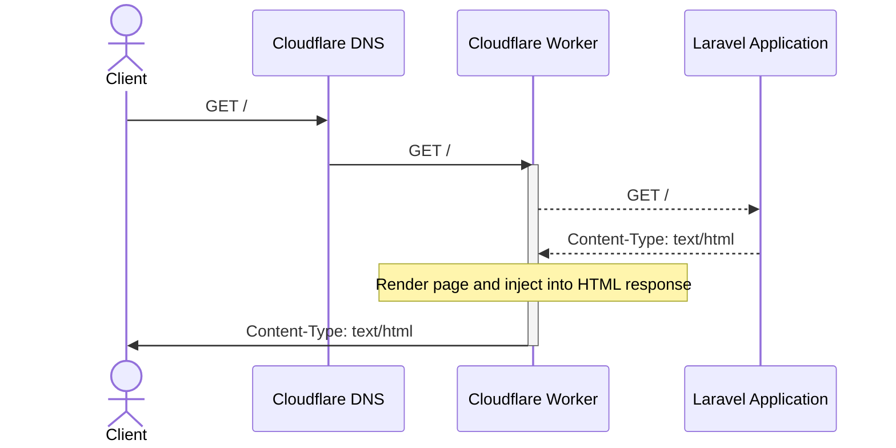
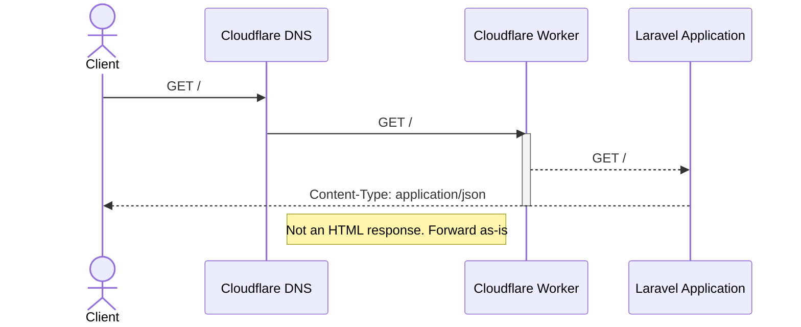

# POC Inertia Edge SSR

## How it works

This proof of concept integrates InertiaJS Server-Side Rendering with Cloudflare Workers instead
of using a separate NodeJS server to render the pages.

The Worker would be configured with a trigger whenever a request is made to the Laravel application
and it would intercept the response and try to load Inertia's `page` data from the response body.

If no `page` data is found, the Worker would forward the response as-is to the client.
If `page` data is found, the Worker will try to decode it (because it's encoded as JSON) and then
render the page using the same `createInertiaApp` function that would be used in its NodeJS counterpart.



Any requests to the application that do not result in a `Content-Type: text/html` response will be
forwarded as-is to the client.



## Installation

Install composer and pnpm dependencies:
```shell
composer install
pnpm install
```

Copy `.env.example` to `.env` and generate an application key:
```shell
cp .env.example .env
php artisan key:generate
```

## Usage

You must build Client and SSR assets beforehand:
```shell
pnpm build        # Client Assets
pnpm build --ssr  # Edge Renderer
```

You can also opt-in to watch mode in separate terminals:
```shell
pnpm build -w       # Client Assets
pnpm build --ssr -w # Edge Renderer
```

After that, you can start the Laravel Server:
```shell
php artisan serve
```

Lastly, you must also start the Edge Server:
```shell
pnpm wrangler dev
```

As we're trying to test the Edge Renderer, you must access the app through the Edge Server,
not the Laravel Server, at `http://localhost:8787`.

The SSR code is located at `resources/js/ssr.ts`.
